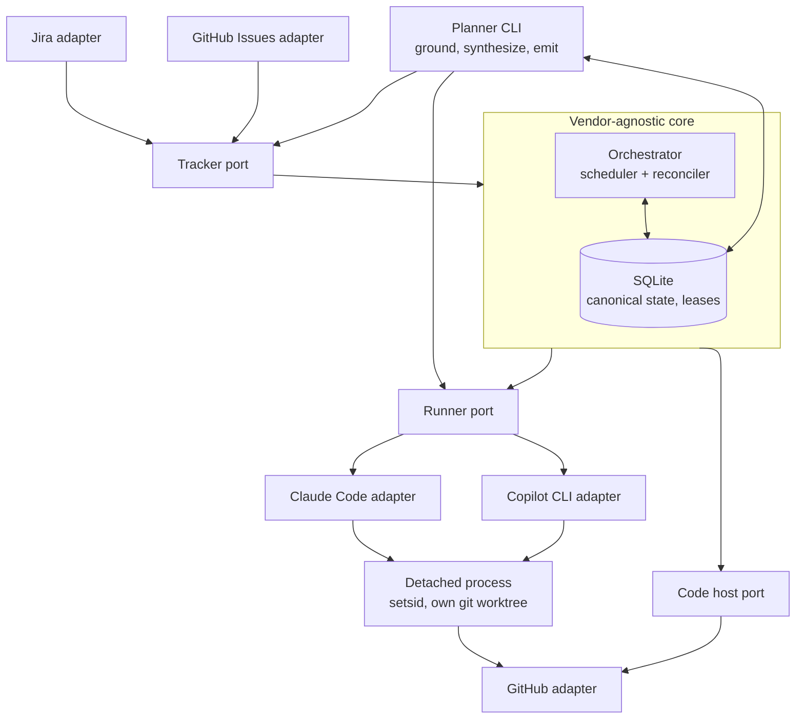
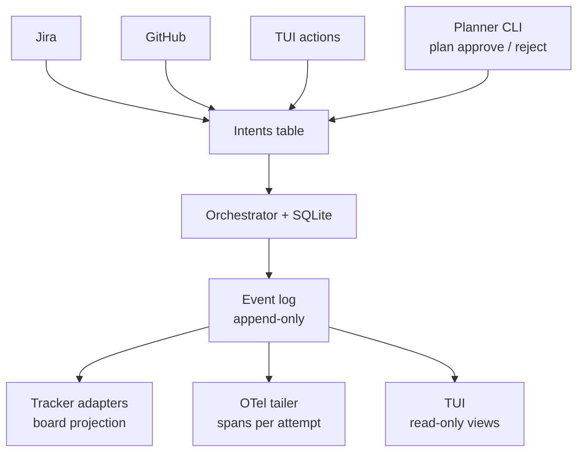
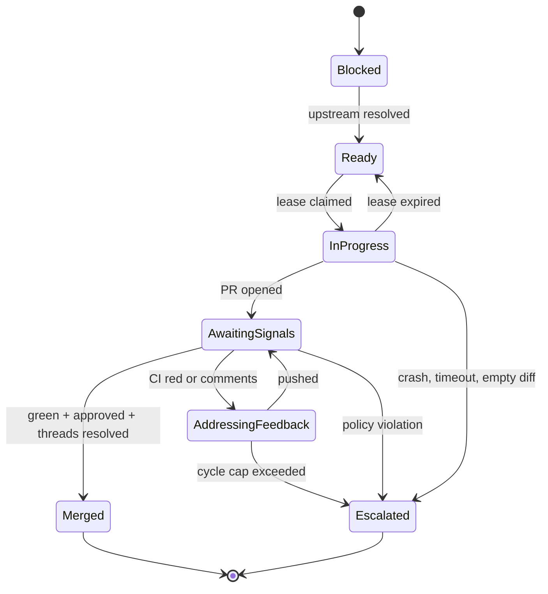
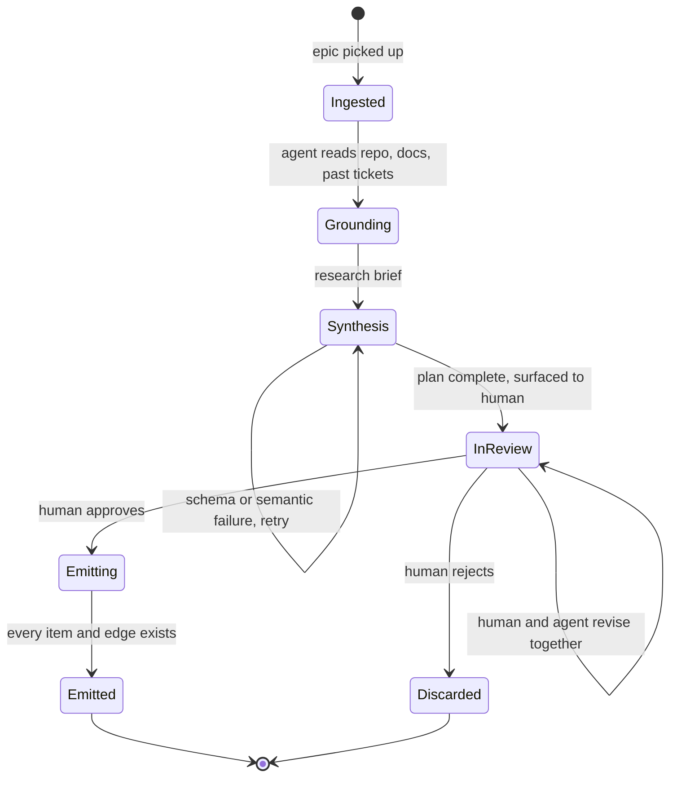

<!-- Imported solution-architecture document. This is background context;
     binding decisions live in docs/adrs/ (see ADR-0001). -->

# ticketflow — solution architecture

Status: draft. Living document.

A local orchestrator that reads a dependency graph out of an issue tracker,
dispatches coding agents against the ready nodes, and lets the target repo's
own CI and review agents decide whether the work is acceptable.

**ticketflow adds no safety of its own. It inherits yours.** Read §1.1 before
anything else — it is the assumption everything here rests on.

---

## 1. Goals and non-goals

**Goals**

- Dependency-aware scheduling: run what is unblocked, in parallel where safe.
- Tracker-agnostic. Jira and GitHub Issues are both first-class.
- Runner-agnostic. Claude Code and GitHub Copilot CLI are both first-class.
- Work from nothing. A tracker is the only prerequisite; the repo can be the
  first thing the graph creates.
- Survive orchestrator restarts without losing in-flight agent work.
- Make agent work visible where the team already looks.

**Non-goals**

- Replacing CI. The repo's existing pipeline is the source of quality signal.
- **Implementing quality or integrity gates.** We publish guidance and consume
  conclusions. The repo owns the checks (§8).
- **Judging code.** ticketflow never parses a diff or forms an opinion about a
  change.
- Being a general agent framework. This schedules tickets; nothing more.
- Multi-tenant or hosted operation. Single operator, local process.

### 1.1 The governing bet

**A repo that is safe to hand to an autonomous agent is a repo that was already
well run.** That is the whole thesis, and every design decision here follows
from it.

Nothing in this system is a gate. There is no diff policy engine, no conformance
check, no classification of your CI jobs, no opinion about your code. ticketflow
asks the host one question — can this pull request be merged? — and acts on the
answer. Branch protection, required checks, tests that fail for real reasons,
reviewers who catch things, acceptance criteria a machine could verify: these
are the safety system. We consume them.

**"AI readiness" is not a separate discipline.** It is not a product, a
certification, or a layer you buy. The practices that make agent work safe are
the practices that were already worth having: they are how you kept humans from
merging broken code, and agents are not a new category of author. A team that
has done this work is ready today. A team that hasn't should do the work, not
buy a compensating control.

**Autonomy scales with rigour, and the framework makes that legible.** With
strong gates you can start an epic and leave it for days, because every merge
had to satisfy rules you wrote. With weak gates you should watch it, because the
same loop will merge whatever passes — which, on a repo with no checks, is
everything. That is not a failure mode we are papering over. It is the honest
consequence of pointing an autonomous system at an unguarded branch, and it is
stated plainly in §8.4 rather than hidden behind a warning we make you dismiss.

**Bootstrap is the exception, and it is the point.** A repo need not exist. The
only hard prerequisite is a tracker — a Jira project or a GitHub Project board.
"Create the repo", "add the CI pipeline", "turn on branch protection" are
perfectly good early nodes, and a graph that starts with them is a graph that
builds its own safety system before the work that needs it.

So the thesis is about trajectory, not a starting condition. Early bootstrap
nodes run with almost no gates because there are none yet, and that is fine:
they are small, they are first, and a human is watching a brand-new project. By
the time the graph reaches work that matters, the gates it created are the ones
judging it.

**Why we refuse to own the gates.** Checks that live in a framework are checks
your team does not own, cannot tune, and will not maintain. They would be
generic where yours are specific, and they would invite a team to outsource
judgement it should be keeping. Worse, they would create the impression that
installing a tool made a repo safe. The repo makes the repo safe.

---

## 2. Invariants

These five hold everywhere. If a change violates one, the change is wrong.

1. **SQLite is truth.** Boards, traces and the TUI are projections and may lag.
2. **All human signals enter through the intents table**, whatever the source.
3. **Adapters translate; they never decide.** No scheduling logic in an adapter.
4. **Every dispatch is idempotent and leased.**
5. **The target repo is read-only to ticketflow, except for branches and PRs.**
   We never configure gates, never modify workflows, and never judge a diff.

---

## 3. Component architecture



Three ports, so the core never learns a vendor's vocabulary. GitHub gets two
independent adapters — one for tracking, one for code hosting — which is what
allows Jira-for-planning plus GitHub-for-code.

The planner (§13) sits outside the core: an offline phase sharing the same
ports and the same database. It grounds through the runner port, stores plan
state in its own SQLite tables, and emits approved child tickets through the
tracker port. It never talks to the orchestrator — its output re-enters the
core only as ordinary synced tracker items.

**The orchestrator is not an agent.** It is deterministic Python: a topological
ready-set, a lease table, and a reconcile tick. No model runs in the scheduling
loop. Reproducibility is what makes crash-recovery, idempotency and unit tests
mean anything. Agents run inside nodes; they never decide what runs next.

---

## 4. Control flow: intents in, projections out

Every human signal converges on one table. Every outward surface reads from one
append-only log.



Plan approval is just another human signal converging on the same table: the
CLI writes a `plan_approve`/`plan_reject` intent, the planner turn consumes
it (the tick leaves the `plan_` namespace pending), and planner events flow
into the same log.

The TUI is not privileged. When it grows a retry button, that button writes an
intent, exactly like a Jira status move does. One path for "a human asked for
something" is what stops the TUI becoming a second orchestrator.

---

## 5. Domain model

| Concept | Notes |
|---|---|
| `node` | Canonical unit of work. Has a `node_id` independent of any tracker. |
| `external_refs` | `(node_id, provider, external_key, etag)`. One node may be a Jira ticket *and* a GitHub PR. |
| `edge` | Dependency. Parsed from a `depends-on:` block in the issue body. |
| `attempt` | One dispatch of a runner against a node. Owns its run dir and trace. |
| `lease` | Claim on a node, with expiry and worker id. Prevents double dispatch. |
| `intent` | Normalized human signal: approve, reject, unblock, cancel, retry. |

**Dependencies live in the issue body**, not in native link types:

```
depends-on: PROJ-41, PROJ-38
```

Both trackers store this identically. Native Jira links and GitHub
relationships/sub-issues are a *mirror* for human readability, written by the
adapter (the planner's emit path writes them for emitted children, §13.7),
never read as truth. This means someone editing links in the Jira UI cannot
corrupt the DAG.

---

## 6. Node state machine



**Transition guards**

- `Blocked → Ready` — all upstream edges resolved. The only place graph
  structure matters.
- `Ready → InProgress` — orchestrator takes a lease *before* dispatch. A lease
  that expires without a heartbeat rolls back to Ready.
- `InProgress → AwaitingSignals` — runner exited, branch pushed, PR opened.
- `AwaitingSignals → Merged` — composite condition. All three parts required;
  none alone is terminal.
**Escalation triggers**

`Escalated` is the single needs-a-human state. It is reachable from any active
state, because failures that iteration cannot fix occur at every stage.

| From | Trigger | Why a human |
|---|---|---|
| InProgress | Runner crashed, repeated across attempts | Environment or tooling fault |
| InProgress | Wall-clock timeout | Ticket is probably too large to be one node |
| InProgress | Clean exit, empty diff | Acceptance criteria are ambiguous |
| InProgress | Repeated lease expiry | Process keeps dying without a heartbeat |
| InProgress | Tool policy denial | Only a human can widen `ToolPolicy` (not reachable under `--yolo`, §14) |
| InProgress | Provider quota exhausted | Dispatch pauses; a human resolves the account limit |
| AwaitingSignals | Checks stuck red past the cycle cap | The ticket or the code needs a human |
| AddressingFeedback | Cycle cap exceeded | Agent is not converging on the feedback |

The InProgress failures never produce a PR, so the review loop cannot catch
them. Without an explicit edge they fall through to lease expiry and retry
silently forever, which is the expensive failure mode.

Escalation is terminal for the orchestrator. A human resolves it by writing an
intent, which re-enters the machine at `Ready`. Three exits, depending on what
was actually wrong:

- **Feedback to the agent.** The approach was fine, the agent missed something.
  Resume the session with a correction; attempt counters reset.
- **Fix it directly.** The human edits the worktree or the branch — sometimes a
  one-line fix is faster than explaining it — then tells the agent to continue
  from there.
- **Fix the ticket.** The description or acceptance criteria were wrong, which
  is the most common cause of a node grinding against CI. Amend the tracker item
  and re-dispatch against the corrected spec.

A node stuck in `Escalated` blocks its dependents (§12.4). That is acceptable
and intended — the whole graph waiting on one human decision is better than
building on a foundation nobody approved.

---

## 7. Ports

### 7.1 Tracker port

```
fetch_nodes(cursor)      -> canonical nodes since last sync
fetch_intents(cursor)    -> normalized human signals
push_state(node, state)
push_comment(node, text)
create_item(title, body, labels, parent_key) -> external_key
update_body(node, body)
mirror_dependencies(node, depends_on)
capabilities()           -> what this backend can actually do
```

The last three exist for plan emission (§13.7): creation returns the
tracker-assigned key, bodies are rewritten with `depends-on:` lines only
after every key exists, and `mirror_dependencies` writes the backend's
native mirror — Jira `is blocked by` links; GitHub blocked-by relationships,
falling back to a Projects v2 "Blocked by" field — write-only, per §5.

Backends are unequal, so the core asks rather than assumes:

| Concern | Jira | GitHub Issues |
|---|---|---|
| Dependencies | `is blocked by` links | Sub-issues, or parsed body |
| Custom states | Workflow statuses | Projects v2 field, or labels |
| Approval | Status transition | PR review, or a label |
| Terminal | Status `Done` | Issue closed |

`capabilities()` returns flags such as `native_dependency_links` and
`custom_state_field`. GitHub without a Project board degrades to labels.

### 7.2 Runner port

```
start(node, workspace, policy) -> handle
poll(handle)                   -> running | exited(code) | timed_out
resume(handle, feedback)       -> handle
cancel(handle)
capabilities()
```

Async-shaped deliberately, so a remote agent (assign-issue-and-wait) fits later
without reshaping the core.

**Both runners have official Python SDKs.** Use them rather than wrapping CLIs
by hand:

| Runner | Package | Licence |
|---|---|---|
| Claude Code | `claude-agent-sdk` | Anthropic, official |
| Copilot CLI | `github-copilot-sdk` | MIT, official, GA + semver |

Both bundle their CLI as a dependency, so nodes need no separate agent install.

- **We own the process, not the SDK.** Both SDKs will spawn and manage the agent
  CLI for you, which conflicts with §10 — if the SDK owns the child, orchestrator
  death kills the agent. Instead, spawn the CLI in **server mode** ourselves as
  the detached, `setsid` process we track by `(pid, create_time)`, and connect
  the SDK to it as a client. Supervision stays ours; protocol handling is theirs.
- **Tool policy is core-owned, enforced via permission handlers.** A `ToolPolicy`
  of allowed shell commands, write paths and URLs is defined in the core. Both
  SDKs expose a per-tool-call permission callback, which is strictly better than
  compiling to CLI flags because the callback sees the actual arguments. Note
  that the Copilot SDK defaults to permissive (equivalent to `--allow-all`), so
  installing the handler is mandatory, not optional.
- **Resume carries feedback.** Attempt N+1 resumes the original session with the
  review comments injected, rather than cold-starting. Falls back to cold start.
- **Model is pinned per node class**, read from config.
- **BYOK caution.** The Copilot SDK supports bringing your own provider keys.
  Do not point the worker and the policy reviewer (§8) at the same underlying
  model this way — that reintroduces the correlated blindness the CI-side gate
  exists to avoid.

### 7.3 Code host port

```
open_pr(node, branch)
get_pr_status(pr)        -> per-check conclusions, review decision,
                            unresolved thread count
get_feedback(pr, since)  -> normalized comments (path, line, thread id, author)
resolve_thread(thread_id)
merge(pr)                -> normally unused; see §9
```

GitHub only for now. The port exists so `FakeCodeHost` can run in tests.

---

## 8. Repo requirements: the gate-integrity contract

> **ticketflow does not implement quality or integrity gates.** It defines the
> contract a repo must satisfy to be a valid target, verifies conformance before
> dispatching, and consumes the resulting check conclusions as opaque signals.
> Setting the repo up is the user's responsibility.

This boundary exists because the failure mode is real but the detection is
research, not engineering. **The dominant practical failure of "make CI green"
as a goal is that the agent makes CI green by weakening CI** — deleting the
failing test, loosening an assertion, adding `# noqa`, suppressing a scanner
finding, marking a test flaky. Each is locally reasonable from inside the
agent's context window; each produces a green PR and a worse codebase.

Detecting this well is repo-specific, language-specific and high-false-positive.
It belongs next to the code, in the repo's own pipeline, owned by the team who
can judge whether a given weakening was legitimate.

### 8.1 What a well-configured repo provides

**None of this is verified.** ticketflow runs against whatever repo it is
pointed at. These are recommendations we publish, not preconditions we check —
validating someone's engineering practices is not the framework's business.

| # | Recommendation |
|---|---|
| R1 | Branch protection on the target branch, with required status checks. |
| R2 | Checks that detect gate weakening, not just gate failure (see §8.2). |
| R3 | CODEOWNERS covering CI workflow, lint, scanner and coverage configuration. |
| R4 | Required approvals ≥ 1, satisfiable by a reviewer the agent cannot act as. |
| R5 | Merge queue enabled (see §12.1). |
| R6 | Agent identities have no admin rights and cannot alter branch protection. |

R3 and R6 together are what make the whole scheme hold. Note the useful
asymmetry: **deleting a required check does not help the agent**, because the
host blocks merge when a required check never reports. The only viable attack is
weakening a gate in place — which is exactly what CODEOWNERS covers.

### 8.2 What the repo SHOULD provide

Recommended, not enforced. These are the checks that catch weakening; how they
are implemented is entirely the repo's business.

- **Diff-scoped coverage ratchet** — coverage on changed lines, compared to base.
- **Suppression scan** — fail when the diff introduces `# noqa`,
  `eslint-disable`, `@ts-ignore`, scanner ignore entries or baseline additions
  not present in the base.
- **Test-count / skip ratchet** — fail on deleted tests or newly added skip and
  xfail markers.
- **Baseline-diffed static analysis** — report only findings new since the base
  commit.
- **A policy reviewer** — an LLM reviewer whose only question is "does this
  change reduce the strength of our checks, and where". Distinct from a general
  code reviewer, and **on a different model or provider to the worker**;
  otherwise correlated blindness returns.

We ship these as reference workflow templates in `examples/`. They are
illustrative and unsupported — the repo owns them.

### 8.3 The interface: none

ticketflow has **no configuration describing the repo's checks.** It does not
know their names, their purpose, or whether any exist. It asks the host one
question — can this pull request be merged? — and acts on the answer.

ticketflow never parses a diff, never inspects a finding, and never forms an
opinion about the code. It reads conclusions.

### 8.4 No preflight

ticketflow does **not** verify repo configuration before dispatching. There is
no conformance check, no refusal, no cadence scan. A repo with no branch
protection is a valid target; its PRs will simply merge quickly, and that is the
operator's informed choice.

Nothing needs verifying, because nothing is assumed. With no check config
(§8.3), there is no mismatch to detect — a renamed CI job, a deleted workflow or
a repo with no gates at all are all just different answers to "can this merge?"

What we do record, because the event log records everything anyway: which checks
reported on each PR and how the merge happened. That is observation, not
validation, and it is what makes "we merged 40 PRs with no gates" visible after
the fact.

### 8.5 Guidance we publish

`REPO_REQUIREMENTS.md` is the user-facing form of §1.1, and it opens with the
thesis rather than the checklist: the work described here is not AI-specific
overhead, it is ordinary engineering rigour, and doing it buys you autonomy you
cannot get any other way.

It then covers R1–R6 as recommendations, the §8.2 techniques, reference workflow
templates, and one strong piece of advice: **apply the gates to every PR, human
or agent.** A gate that only applies to one author class teaches people which
author class to use.

The document is normative in tone and advisory in force. Nothing in ticketflow
enforces it — which is precisely why it has to be persuasive.

## 9. PR-native review loop

The repo's own CI and review agents are the quality gate. The orchestrator
observes; it does not judge. Everything loops — there is no class of failure
that is handled differently.

### 9.1 The merge decision

Asked on every settle, in order:

0. **Does the repo exist yet?** If not, there is no PR to merge — the node's
   work is its initial push. Done when the push succeeds.
1. **Are the checks green?** If any are red, the agent fixes them. Loop.
2. **Are all review threads resolved?** If not, the agent addresses them. Loop.
3. **Are required approvals satisfied?** If yes, merge.
4. **If not, can auto-merge be set?** Set it and move on; the host merges when
   the last approval lands.
5. **If none of the above apply** — no checks, no required reviewers — merge.

A repo with no gates merges immediately. A repo with gates merges when its own
rules say so. ticketflow does not distinguish the cases; it just reads the
answer.

**Gates can appear mid-run.** Node 1 creates the repo, node 3 adds CI, node 5
turns on branch protection — and node 12 is judged by all of it. Because there
is no check config and no preflight, this needs no special handling: each settle
asks the same question and gets whatever answer is true at that moment.

### 9.2 Loop mechanics

**Settle window.** Do not re-dispatch on the first webhook. Wait until all
checks have reported *and* review agents have posted, then dispatch once with
the batched feedback. Reacting per comment causes a push per comment, which
re-triggers CI — an expensive oscillator.

**Cycle cap.** Default 100, configurable, tracked separately from dispatch
attempts. It is the only backstop, so it is deliberately generous — an agent
grinding through a long chain of unrelated CI failures should be allowed to
finish. A cap that fires is a signal the ticket is wrong, not that the agent
needs one more try.

**Flaky handling.** Re-run a failed check once before treating it as the agent's
problem, and track per-check flake rates in SQLite. An agent handed a flaky
signal will rationally "fix" it by deleting the test.

**Local gates shrink** to a fast pre-push smoke check, so obviously broken
pushes do not burn CI.

---

## 10. Process supervision

Baseline is plain detached processes. No daemon dependency.

**Workspace strategy is per-attempt, and detected rather than configured.** Ask
the code host whether the repo exists:

- **Repo exists** → a git worktree branched from the default branch, per the
  usual isolation model.
- **Repo does not exist** → an empty working directory. There is nothing to
  branch from, so the agent scaffolds, initialises, and pushes. Subsequent
  attempts take the worktree path automatically because the repo now exists.

Everything below applies identically to both.

- `setsid` (or double-fork) so the child leaves the orchestrator's process
  group. Without it, SIGHUP on orchestrator exit kills the agents.
- Per-attempt run directory:

```
runs/<node_id>/<attempt>/
  meta.json      pid, start_time, runner, model, session_id, trace_id
  stdout.log
  stderr.log
  exit_code
  heartbeat
```

- **PIDs get reused.** Store pid *and* process start time; validate both.
- **Exit code capture** for a process we are not waiting on:
  `sh -c 'agent ... ; echo $? > exit_code'`. The file's existence is the
  completion signal; its contents are the result.
- **Startup adopts, it does not clean up.** Scan run dirs for anything the DB
  calls in-flight; re-attach live ones, harvest finished ones, expire the rest.
- **Optional upgrade:** `systemd-run --user --unit=ticketflow-<node>-<attempt>`
  for journald logs and `MemoryMax` / `CPUQuota` caps. Linux only, needs
  `loginctl enable-linger`. Same runner port, selected by config.

**Success is never stdout.** It is exit code, then checks, then a non-empty
`git diff --stat`. An agent that says "I've fixed it" and changed nothing is a
common failure and only the diff catches it.

---

## 11. Observability

**Emit spans from the event log, not from control flow.** A tailer reads the
append-only event table and emits spans from recorded timestamps. Telemetry
becomes a projection — it can lag, fail, or be replayed without touching
correctness. Holding spans open in memory across a two-hour node means a crash
loses the trace.

- **One trace per node attempt.** Graph runs last too long to be usable traces.
- **Span links** point an attempt's trace at its upstream attempts. That is how
  the DAG is reconstructed in the backend without one monster trace.
- **Attributes:** `node_id`, `attempt`, `runner`, `model`, `exit_code`, per-check
  conclusion, policy verdict, token cost.
- `trace_id` is stored on the SQLite row so the TUI can deep-link.

**TUI is read-only.** WAL mode, `busy_timeout`, never hold a transaction across
a render. Views that earn their place: the DAG with node states, in-flight work
with elapsed time, attempt and cycle counts, policy violation rate, cumulative
cost — and the plan review screen (§13.5).

Read-only means read-only over *state*. The review screen edits a plan file and
writes an approval intent; it never mutates node state directly. Rendering the
DAG uses `grandalf` for layout, which is also what makes a web UI unnecessary.

---

## 12. Decisions

### 12.1 Merge conflicts between parallel nodes

**Use GitHub's merge queue.** It rebases each PR onto the latest base and
re-runs CI serially before merging — the serializer we would otherwise build,
sitting at the enforcement point we already chose. Enable "require branches to
be up to date."

Two cheap layers on top:

- **Scope hints.** An optional `scope:` block in the ticket lists paths the node
  expects to touch. The scheduler avoids dispatching overlapping nodes
  concurrently. Advisory only — agents exceed declared scope — but it prevents
  the obvious collisions.
- **Conflict resolution gets a tighter leash than normal feedback.** When the
  queue rejects a PR for conflicts, re-dispatch with a narrow "resolve this
  rebase conflict" prompt, capped at **one** attempt, then escalate. This is
  where agents silently discard other people's work.

### 12.2 Handoff context along edges

Each node's final action writes a `handoff.md`, capped at roughly 300 words:

- files touched;
- interfaces introduced or changed;
- decisions made and why;
- what it deliberately did *not* do;
- known gotchas.

Stored in SQLite keyed by node, and posted as a PR comment so humans get it too.

**Downstream prompts receive direct upstream handoffs only — never
transitive.** Grandparent context compounds until it crowds out the ticket, and
the merged code describes itself better anyway. The handoff carries intent and
warnings, not description.

### 12.3 Spend is out of scope

**ticketflow does not manage budgets.** Spend limits belong to the model
provider account and the API keys the operator configures. Duplicating them here
would mean two places to set a cap and one of them wrong.

What remains is not budgeting:

- **Per-attempt runaway guard.** A hard wall-clock and token ceiling per
  attempt, which kills a stuck process. This is the same category as the retry
  cap — it terminates a loop, it does not manage spend. Nothing else kills a
  running agent; the tokens are already spent and killing forfeits the output.
- **Cost recording.** Real cost per attempt goes to the event log as telemetry.
  Recording is not enforcing, and it is what reveals which ticket shapes are
  expensive. Note that cost units differ per runner — Claude bills tokens,
  Copilot counts prompts against an allowance — so the adapter normalizes at its
  boundary rather than assuming tokens everywhere.

**Quota exhaustion needs its own error class.** A provider-side limit is a hard
wall, not a graceful stop: when the account hits its cap, every in-flight node
fails simultaneously with quota errors. Treated as ordinary failures, that burns
every node's retry allowance in seconds and buries the real cause.

Classify quota and rate-limit errors distinctly. On detection, pause dispatch
and surface the reason rather than consuming attempts. Resume is an intent, the
same as any other human signal.

### 12.4 Escalated nodes and their dependents

Dependents stay `Blocked` with a `blocked_reason` naming the escalated ancestor,
so the board shows root cause rather than a silent stall.

- **Do not cancel the subtree.** It destroys work and the information about why.
- **Do not let dependents proceed.** They would build on a foundation nobody
  approved.
- **Halt heuristic:** if the scheduler finds nothing dispatchable for N ticks
  while escalations exist, halt and notify. A process that looks healthy and is
  doing nothing is worse than one that stops.

### 12.5 Policy reviewer on human PRs

**Yes, with no difference.** Human code and agent code are treated identically.
A gate that only applies to one author class is a gate that teaches people which
author class to use.

### 12.6 Scope hints stay advisory, and deterministic

Because the merge queue (§12.1) already catches collisions, scope hints are not
a correctness mechanism. They only reduce wasted CI runs on PRs that will need
rebasing. That makes this an efficiency knob, and efficiency knobs do not get a
model in the loop.

"Advisory" means three specific things:

1. **A scheduling bias, never a block.** Overlapping ready nodes are preferably
   staggered. If staggering would idle the pool, dispatch anyway.
2. **Prompt context.** The declared scope goes to the worker as expected-touch
   guidance. Soft.
3. **A measured signal.** Declared-vs-actual paths are recorded per attempt in
   the event log.

Point 3 is what decides the future of the feature. If declared scope predicts
actual scope poorly, the hint is noise and should be replaced by a simple
parallelism cap.

An LLM may *generate* the `scope:` block at planning time, when the ticket is
written — offline, one-off, human-reviewable. It never evaluates one at dispatch
time.

### 12.7 Retention

Split by class, because agent logs are almost all the bytes and everything else
is kilobytes.

| Class | Typical size | Default retention |
|---|---|---|
| Agent stdout/stderr | MB per attempt | 14 days, or a 10 GB total cap |
| `meta.json`, exit codes | bytes | 12 months |
| Research briefs | tens of KB | 12 months |
| Plan revisions | KB | 12 months |
| Handoffs | KB | 12 months |
| Event log | — | never deleted |

**Nothing belonging to a non-terminal run is deleted, at any age.** Epics can run
longer than 14 days, and §12.2 has downstream nodes reading their upstream
handoffs — age-based deletion would remove a live input. Liveness beats age.

**The total cap is a backstop, not a policy.** Compressed, 10 GB is roughly
100 GB of raw log, so the 14-day sweep will fire first in normal operation. The
cap exists to stop a disk filling, and if it is being hit regularly something
else is wrong.

**Cap per-attempt log size, not just the total.** Default 500 MB raw, which is
two orders of magnitude above a typical attempt and still catches a runaway
before it evicts the history. Truncate the middle rather than the tail; the end
is where the failure is. Log every truncation and eviction to the event log —
history that vanishes silently is worse than history that is gone.

**Compress on attempt completion.** Text logs gzip roughly tenfold, which makes
the total cap generous rather than tight.

**The small artifacts are the valuable ones.** Briefs, plan revisions and
handoffs are what the §13.5 diff metric and any future planner tuning read from.
They cost almost nothing to keep, so keep them well past the logs.

---

## 13. The planner

A separate, offline phase in front of the scheduler. It exists because real
epics are underspecified: humans omit dependencies, and title-only tickets are
common.

### 13.1 Why it does not compromise determinism

**An LLM authoring the graph is not an LLM executing it.** The planner reads a
messy tracker item, proposes a decomposition, and — after human approval —
writes real child tickets with real `depends-on:` blocks back to the tracker.
From that moment the graph is materialized and the scheduler reads it exactly as
it would a human-authored one.

### 13.2 Two jobs, two risk profiles

| Job | Risk | Gate |
|---|---|---|
| **Enrichment** — draft missing descriptions and acceptance criteria | Low. A human reads the ticket before work starts. | Normal review |
| **Dependency inference** — propose edges between items | High. Wrong edges change execution order invisibly. | Explicit per-edge confirmation |

Published evidence supports weighting the second gate heavily. Benchmarks on
LLM dependency inference report F1 around 50% on realistic inputs, with models
systematically **over-predicting** edges — hallucinating plausible dependencies
rather than extracting evidenced ones.

Over-prediction is the safer failure direction for us: a spurious edge causes
unnecessary serialization (slow but correct), while a missed edge causes unsafe
parallelism. The reviewer's main job is therefore **pruning**, not adding.

Consequently the planner's output schema **must** carry, per proposed edge, a
confidence value and the evidence it was drawn from. Edges without citable
evidence are surfaced separately.

### 13.3 Lifecycle



`Emitting` has no edge to `Discarded`: there is no rollback for a partially
emitted plan — re-running emit is the recovery path (§13.7).

**A long pause is not a long run.** The planner completes in minutes. Approval
may take days, during which no process is resident — the proposal lives in
SQLite and a fresh invocation resumes it. This is the same invariant as
everywhere else: state lives in the database, not in a process.

Grounding is the largest lever on plan quality. Dependency inference accuracy
collapses on thin input and improves markedly with real context, so reading the
repo and linked docs is not optional polish.

### 13.4 Implementation: two phases

The planner splits into a tool-using phase and a pure transformation. This is
not cosmetic — the two halves want different abstractions.

| Phase | Does | Runs on | Output |
|---|---|---|---|
| **Grounding** | Reads the repo, linked docs, related tickets | `RunnerPort` (headless CLI adapters, ADR-0011) | Research brief |
| **Synthesis** | Turns brief + raw ticket into the plan | PydanticAI | Validated plan schema |

**Grounding scope: baseline plus agent judgement.** Direct dependencies always
have their summaries attached to context automatically — that is the guaranteed
floor, and it is the same handoff artifact defined in §12.2. Beyond that, the
agent decides whether more is needed and explores the tracker's past issues
itself using search tools.

This avoids both failure modes: a fixed narrow window that starves thin tickets,
and a fixed wide one that pays to read stale, misleading history on every run.
Two guards: cap grounding tool calls and tokens so exploration terminates, and
attach dates to retrieved tickets so the agent can discount old ones.

**Greenfield planning.** When no repo exists there is nothing to ground against,
so the brief comes from the tracker and linked docs alone. The planner should
emit the bootstrap work — create the repo, add CI, add branch protection — as
upstream of everything else, so the gates exist before the work they judge. This
is a strong default rather than a rule; the human approving the plan can
reorder it.

**Why split.** Grounding is tool-using exploration, which the runner
adapters do natively — and it reuses the `RunnerPort` abstraction, so Claude
or Copilot both work with no new bridge; the brief is captured as `brief.md`
at the workspace root, the same file pattern as handoffs. Synthesis needs no
tools at all, so it is a pure function of its inputs: model-agnostic, cheap,
and unit-testable against recorded briefs as fixtures.

**Why not one phase.** PydanticAI abstracts *model APIs*; the Copilot SDK is an
*agent runtime* driving a CLI over JSON-RPC. They do not compose. There is no
first-party PydanticAI provider for Copilot — only a third-party community
bridge, which is not a dependency to put on the critical path.

**Synthesis stack:**

- **PydanticAI** for the agent loop, typed output and retries on validation
  failure. MIT, post-1.0.
- **Pydantic** models for the plan schema. Semantic validators live here:
  every edge references an existing item, confidence is present, evidence is
  cited.
- **Branch on capability, not on vendor.** A model's `ModelProfile` exposes
  flags such as `supports_json_schema_output`. Use native constrained decoding
  where available (Anthropic's structured outputs — currently beta-gated, so
  pin and verify), and fall back to retry-on-validation-failure where not. Same
  pattern as `capabilities()` on the tracker port.
- **`graphlib.TopologicalSorter.prepare()`** to reject cycles — the same
  primitive the scheduler uses.
- **The existing intents table** for the approval gate. More durable than an
  in-process checkpointer: it survives reboots, version upgrades, and a human
  editing the proposal by hand.

**LangGraph is not indicated.** Its strongest feature here is durable
`interrupt()`/resume, which duplicates the intents table.

### 13.5 Review surface

**Review is a conversation, not a form.** The plan surfaces only when synthesis
considers it complete. The human then works with the planner agent to interrogate
and revise it — "why does 47 depend on 42", "split this item", "drop that edge" —
and the agent edits the plan in response. Approval ends the session.

This is better than hand-editing a file because the agent can re-derive
consequences: removing an edge may free items to parallelise, splitting an item
needs new acceptance criteria, and both need revalidation. A human editing YAML
gets none of that.

**The file remains the artifact.** Every turn writes `plans/<epic-key>.yaml` and
the current state to SQLite. The file is what gets diffed, versioned and
inspected; the conversation is how it changes.

**No resident process.** A review may span days. Each turn resumes the planner
session by id and exits when the turn ends — state lives in SQLite, per
invariant 1. `$EDITOR` on the YAML remains a valid fallback for anyone who
prefers it, and is the shipping path before the TUI exists.

**No web UI.** A third surface needs a server, a port and a frontend, and buys
graph rendering the TUI can approximate with `grandalf`. Because the plan is a
file and approval is an intent, anyone can add one later without touching the
core.

**The TUI hosts the session** — plan on one side, conversation on the other,
edges listed ascending by confidence with their evidence, since §13.2 says the
reviewer is mostly pruning. It gains no write path to state: it edits the plan
file and writes an approval intent, per §4.

**Three rules for the approval path:**

1. **Validate every revision, not just the final one.** The agent can create a
   cycle, orphan an item or drop a referenced key as readily as a human can.
   Re-run synthesis's referential and cycle checks after each turn and reject
   the turn, not the plan.
2. **Version each revision.** The review is multi-turn and may span days;
   keeping revisions means a wrong turn is recoverable and the final approval
   records what was actually approved.
3. **Log the first-proposal-versus-approved diff.** Build this before the TUI.
   That diff is a labelled dataset: how often the planner over-predicts, which
   confidence bands are worth trusting, and whether grounding changes help. It
   is the only way to answer "is the planner improving" without guessing, and it
   feeds the §13.2 thresholds directly.

**Implementation status.** All three rules ship in v1, because they bind the
hand-edit path, not just the conversational one. The shipping surface is the
`ticketflow plan` CLI: `$EDITOR` on the YAML with mandatory revalidation
(`plan edit` / `plan validate`), plus `plan revise --feedback` — a stateless
synthesis turn over (current YAML, feedback, brief), which is what makes the
review resumable across days with no session state. The TUI session host is
not yet built; because the plan is a file and approval is an intent, it can
land later without touching plan state.

### 13.6 Planning completes before execution

There is no mid-execution re-planning. The graph is materialized at approval and
does not change underneath the scheduler.

If a node reveals the decomposition was wrong, it escalates (§6) and a human
decides whether to re-run the planner over the remainder. That keeps the
scheduler reading a stable graph and keeps every structural change gated by a
human, which is the same reasoning as §13.2.

---

### 13.7 Approval is all-or-nothing

A plan is approved whole or not at all. There is no partial emit, no
"create these three items and keep reviewing the rest."

The reasoning is the run shape. An epic run is long — days, largely unattended.
The approval is the last cheap moment to be wrong. Splitting it would mean the
scheduler starts against a graph that is still being edited, and §13.6 exists
precisely to prevent that.

**This makes emission the risky step.** Twelve items is twelve tracker calls,
and the tracker offers no transaction. A failure partway leaves a half-built
epic that looks approved but is not schedulable.

- **Idempotency key per item**, derived from plan id and item index, so a
  retried emit does not duplicate tickets.
- **Emit is resumable.** Record each created item as it succeeds; on retry, skip
  what already exists.
- **The plan is not marked emitted until every item and edge exists.** Until
  then its children are invisible to the scheduler: they sync as ordinary
  nodes but the `tf-plan:` marker holds them Blocked — a hold neither the
  ready-set nor an `unblock` intent may bypass — until the plan reads
  emitted.
- **Emit before edges.** Create all items first, then link dependencies, so a
  failure never leaves an edge pointing at a ticket that does not exist.

The emission pipeline, end to end:

```mermaid
sequenceDiagram
    participant H as Human / --yolo
    participant I as Intents table
    participant P as Planner turn
    participant T as Tracker port
    participant O as Orchestrator sync

    H->>I: plan_approve (revision + content digest)
    P->>I: consume (processed_at guard)
    P->>P: pin approved revision, log first-vs-approved diff
    P->>T: adoption sweep (re-read tf-plan markers)
    loop every item, in index order
        P->>T: create_item (marker, no depends-on)
        P->>P: ledger row = (plan id, item index)
    end
    loop every dependent item
        P->>T: update_body (depends-on with real keys)
    end
    loop best-effort
        P->>T: mirror_dependencies (native links / board field)
    end
    P->>P: status = emitted (only now)
    O->>T: ordinary sync adopts children; hold released
```

**On permanent failure, leave the partials.** No rollback. Deleting tickets is
destructive, often not permitted by the tracker, and throws away the evidence of
what went wrong.

- Tag every created item with the plan id so the orphans are identifiable.
- Escalate with a list of what exists and what failed.
- The plan stays unemitted, so the scheduler never sees the orphans — they are
  inert until a human decides.
- Re-running emit after a fix adopts the existing items via their idempotency
  keys rather than duplicating them, so "leave it" is also the recovery path.

---

## 14. Yolo mode

`--yolo` is agent-side only. It does exactly two things:

- **The plan is auto-approved.** No human review of the planner's decomposition
  or its inferred dependencies (§13.5 is skipped entirely).
- **Agents run without permission prompts.** No `ToolPolicy` allowlist is
  consulted; the agent is not asked to confirm anything.

**It cannot touch the repo's gates, and not by choice.** Branch protection,
required checks and required reviewers are enforced by the host, server-side.
ticketflow has no power to bypass them under any flag — the merge ladder in §9.1
still asks the same question and still gets the same answer. A red check is a
red check.

Everything that is not an approval prompt still applies: the per-attempt runaway
cap, the cycle cap, escalation on crash or timeout, and every artifact.

**One warning at startup, then nothing.** The operator chose the flag and knows
what it does; repeating it on every PR and every event is noise, not safety.
This holds even when the target is the default branch — warn, do not refuse.

Two things still hold:

- **Per-run flag.** Not persisted, not inherited by a resumed run.
- **Artifacts are still written.** Skipping approval does not skip the plan
  file, the brief or the handoffs. The run record is the only review an
  unattended run gets, and the event log captures the flag as a run-level fact
  without any extra ceremony.

Worth noticing: `--yolo` makes the run *more* dependent on the repo's gates, not
less. With the human review gate removed, CI is the only thing left checking the
work — which is §1.1 restated as an operating mode.

---

## 15. Dependencies

Permissive licences throughout (MIT/Apache-2.0/BSD). Pin everything; several are
pre-1.0 or move fast.

### 15.1 The stack

| Concern | Library | Licence | Why |
|---|---|---|---|
| Jira adapter | `atlassian-python-api` | Apache-2.0 | Mature, covers Cloud and Server. `jira` (pycontribs, BSD) is the runner-up |
| GitHub adapter | `githubkit` | MIT | REST **and** GraphQL from one typed client — required for Projects v2 and review threads |
| Scheduler | `graphlib` (stdlib) | — | `TopologicalSorter.prepare()/get_ready()/done()` is exactly a dynamic ready-set. Also the cycle check |
| State store | `sqlite3` (stdlib) | — | WAL mode, `busy_timeout`. Lease pattern modelled on `litequeue` |
| Claude runner | `claude-agent-sdk` | Official | Bundles the CLI; per-tool permission callbacks |
| Copilot runner | `github-copilot-sdk` | MIT | Official, GA, semver. Bundles the CLI |
| Process supervision | `psutil` | BSD-3 | `(pid, create_time)` validation for adoption after restart |
| Git worktrees | `pygit2` | GPL-2 w/ linking exception | First-class `add_worktree`. The `git` CLI via `subprocess` is a legitimate alternative |
| Planner synthesis | `pydantic-ai` | MIT | Typed output, retries on validation failure, model-agnostic |
| Plan schema | `pydantic` | MIT | Semantic validators live here |
| Plan file I/O | `ruamel.yaml` | MIT | Round-trips comments — the plan format carries evidence as trailing comments |
| Telemetry | `opentelemetry-api`, `opentelemetry-sdk` | Apache-2.0 | Explicit `start_time`/`end_time` and creation-time span links. SDK ≥ 1.23 |
| TUI | `textual`, `rich` | MIT | Multi-pane live dashboard and the plan review screen |
| DAG layout | `grandalf` | BSD | Pure-Python Sugiyama layout; what LangChain and DVC use for ASCII DAGs |
| CLI | `typer` | MIT | Type-driven. `click` is the runner-up |

### 15.2 Deliberately not used

| Rejected | Why |
|---|---|
| LangGraph | Topology is discovered from a tracker, not declared. Its durable `interrupt()` duplicates the intents table (§13.4) |
| Prefect, Dagster, Airflow, Luigi | Static DAGs, and most want a server or scheduler service |
| Temporal, Restate, Hatchet, Windmill | All need a separate server. Violates single-local-process |
| DBOS Transact | Genuinely close — in-process, SQLite backend — but the crash-recovery it provides is what §10's adoption logic already does |
| herdr, tmux, supervisor, circus | Process supervision is `setsid` plus a pidfile. No daemon dependency (§10) |
| PyGithub | REST-only. No Projects v2, no review-thread resolution |
| `eventsourcing` | Imposes an aggregate model. The event log is one table |
| Outlines, Guidance, LM Format Enforcer | Constrained decoding needs model logits. Useless against hosted APIs |
| `danger-python`, `coverage-threshold` | Dormant, pre-1.0 — and gate checking is out of scope anyway (§8) |
| Langfuse, Phoenix | Good OTLP backends, but a deployment choice rather than a dependency. Emit OTLP and let the operator point it anywhere |

### 15.3 Not our dependencies

`unidiff`, `diff-cover`, `semgrep` and similar appear in the reference workflow
templates under `examples/` (§8.5). Those run in the user's CI, not in
ticketflow. We do not import them and do not require them.

### 15.4 Pinning

- `githubkit` uses the minor version for breaking changes and tracks GitHub's
  schema. Pin exactly.
- Both agent SDKs move weekly. Pin exactly; keep the adapters thin so an upgrade
  touches one file.
- Anthropic's structured outputs are beta-header-gated. Verify against the
  model in use before relying on constrained decoding, and keep the
  retry-on-validation-failure path for backends without it.
- OpenTelemetry's `gen_ai.*` semantic conventions are still unstable. Namespace
  our own attributes and map to `gen_ai.*` in one place.

---

## 16. Still open

Nothing structural. Remaining unknowns are values to tune from real runs: the
cycle cap, the retention caps, and the grounding tool-call ceiling.
